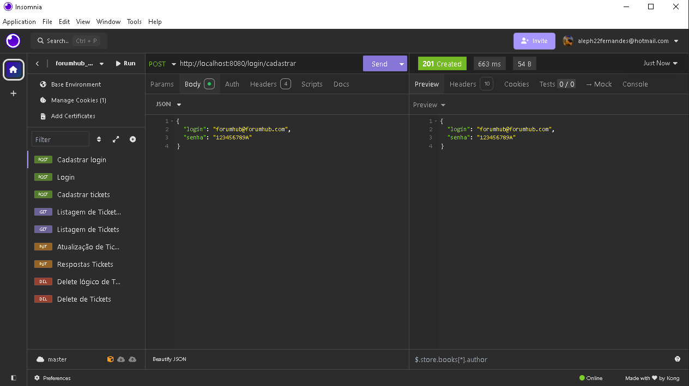
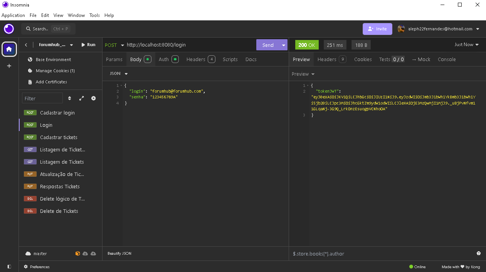
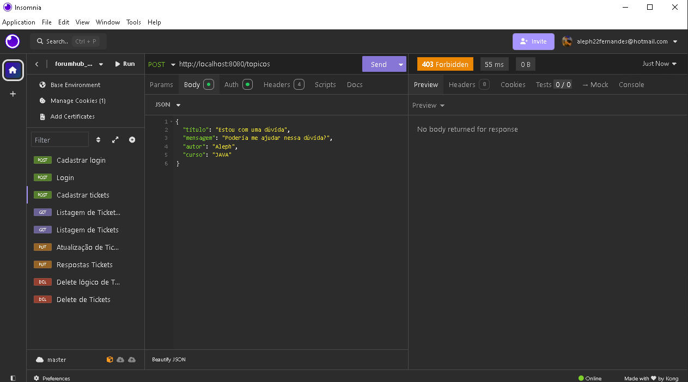
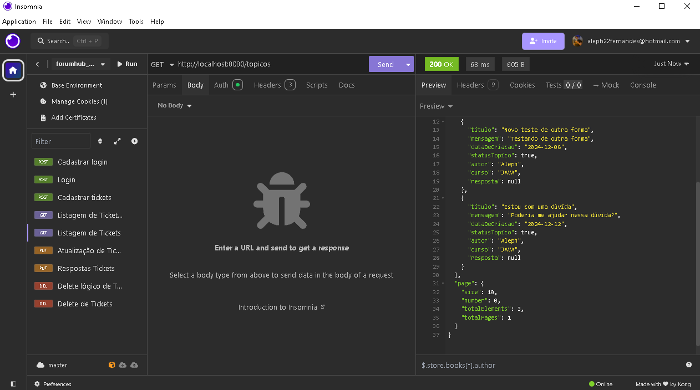
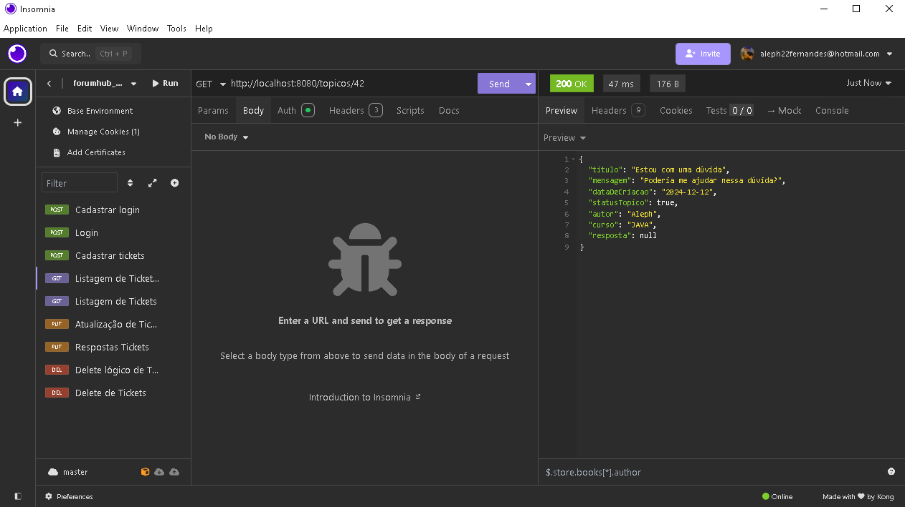
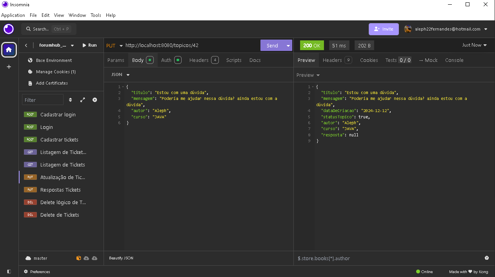
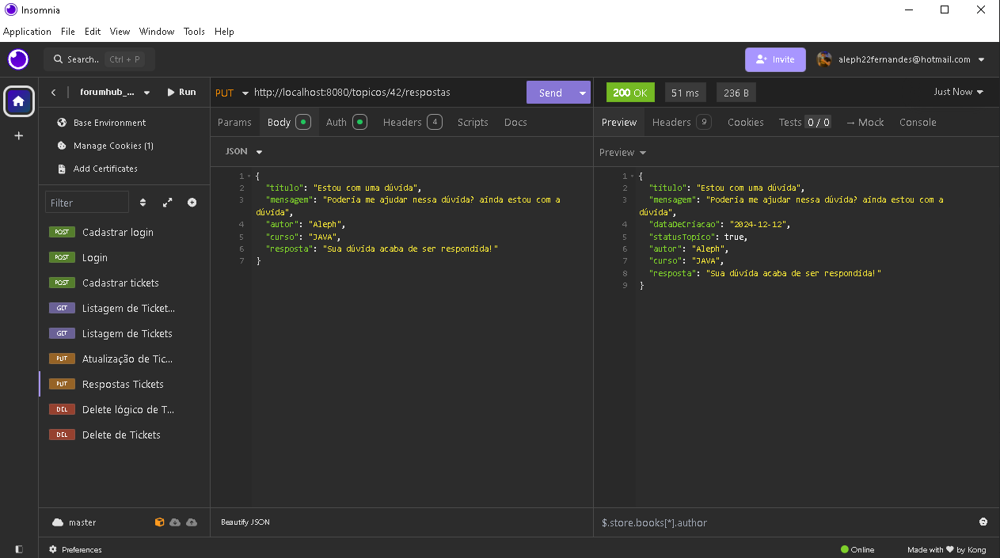
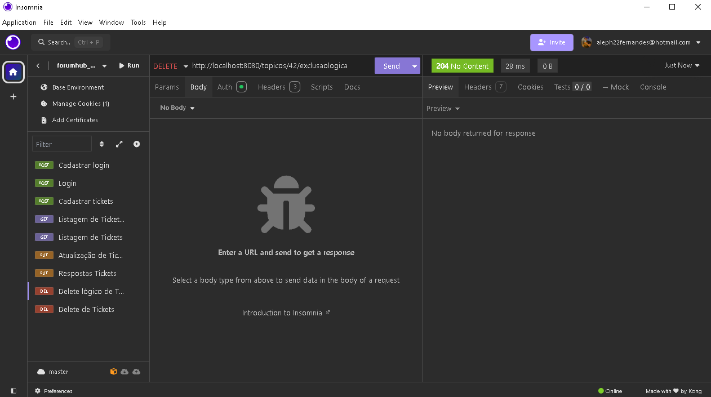

<h1>Projeto Forum Hub</h1>

> <h2> Status: Finalizado ✅ </h2>

> ### Sobre o Projeto

> Este projeto implementa um sistema de gestão de tickets que permite aos usuários realizar operações de maneira segura e eficiente. O sistema possui as seguintes funcionalidades principais:
> ### Gestão de Acessos:  
> + O usuário pode cadastrar login e senha, com as credenciais sendo armazenadas de forma segura por meio de hash de senha.
> ### Autenticação:
> + Após o cadastro, o usuário pode fazer login no sistema e receber um Bearer Token para autenticação.
> ### Gestão de Tickets:
> ##### O usuário autenticado pode:
> + Cadastrar novos tickets.
> + Atualizar informações de um ticket ativo.
> + Responder tickets ativos.
> #### O usuário não autenticado pode:
> + Visualizar tickets marcados como ativos (conforme regra de negócio demonstrada no vídeo do desafio).

> ## Metódos criados na classe AutenticacaoController:

> + 1- Cadastrar Usuário (utilizando login e senha)
> + 2- Efetuar login (Usuário já cadastrado no banco de dados)

> ## Metódos criados na classe TicketController:

> + 1- Cadastrar Ticket
> + 2- Listar tickets ativos no banco de dados
> + 3- Listar por tópico um ticket ativo no banco de dados
> + 4- Atualizar as informações de um ticket ativo
> + 5- Responder um ticket ativo
> + 6- Deletar um ticket do banco de dados
> + 7- Deletar de forma lógica (atualizando o status de "Ativo" para "Inativo") um ticket no banco de dados

> ## SpringDoc:

> + Utilizamos o SpringDoc para gerar a documentação da nossa API.

> ## Tecnologias utilizadas:
> <table>
> <tr>
>  <td>Java</td>
>  <td>Spring Boot</td>
>  <td>Spring Data JPA</td>
>  <td>Spring Security</td>
>  <td>SpringDoc</td>
>  <td>Flyway/Migration</td>
>  <td>MySQL</ td>
>  <td>Insomnia</td>
> </tr>
> <tr>
>  <td>17</td>
>  <td>3.*</td>
>  <td>3.*</td>
>  <td>3.*</td>
>  <td>3.*</td>
>  <td>null</td>
>  <td>8.0</td>
>  <td>10.1</td>
> </tr>
> </table>

> ## Imagem das funcionalidades do projeto:

> #### Cadastrar login:

> 

> #### Acessando:

> 

> #### Erro de acesso (403 Forbidden), pois não foi colocado o Token no Bearer token:

> 

> #### Cadastrar ticket:

> 

> #### Listagem de todos os tickets ativo:

> 

> #### Listagem dos tickets por tópico:

> 

> #### Atualizando as informações de um ticket ativo:

> 

> #### Respondendo um ticket:

> 

> #### Delete lógico de um ticket (atualizando o status de "Ativo" para "Inativo"):

> 

> #### Delete completo (apagando do banco de dados):

>    
